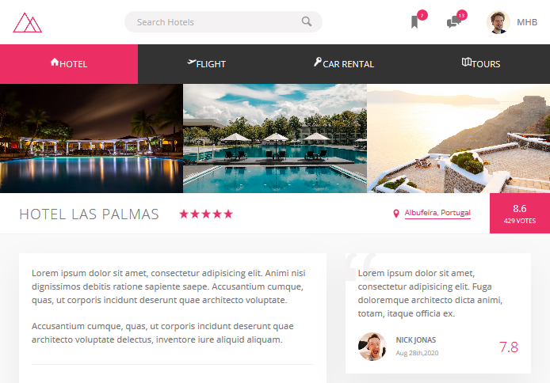

# <a href="https://mahmudul-hasan-bijoy.github.io/Trillo-Flexbox.master/" target="_blank">Trillo | Master CSS Flexbox</a>
  - Onepage Website
  - Advanced Flexbox Tech
  - HTML5
  - CSS3 (No Framework)
  - SASS/SCSS
  - SVG Integration
  - Course instructor: <a href="https://github.com/jonasschmedtmann" target="_blank">Jonas Schmedtmann</a>  

  <a href="https://github.com/actions/setup-node/actions?query=workflow%3Abuild-test">
  
## NPM SCRIPTS

 run `npm install` under root dir to install npm packages.

NPM tasks list:

- `npm run start`: run the website on a live server & compile SASS to CSS
- `npm run build:css`: compile all the SASS files, concatinating, autoprefix and compress CSS/JS into a minified version
  
# License

